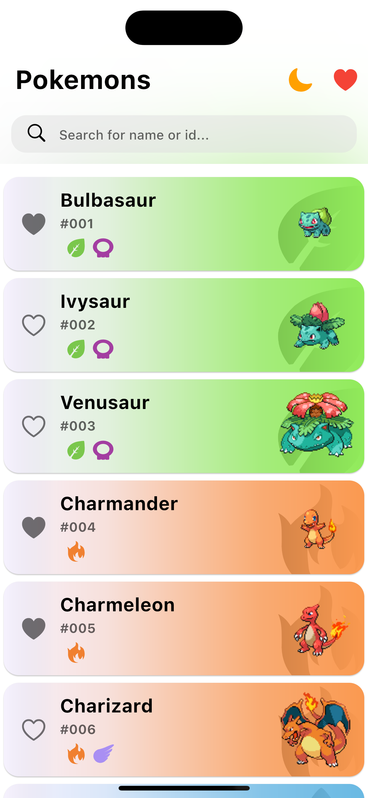

# Pokédex Flutter App

Questa è un'app Pokédex sviluppata in Flutter che consente agli utenti di visualizzare informazioni sui Pokémon. L'app sfrutta diverse tecnologie e librerie per offrire un'esperienza utente intuitiva e ricca di funzionalità.

## Caratteristiche principali

- Visualizzazione dei dettagli dei Pokémon, inclusi il nome, l'altezza, il peso, le statistiche e altro ancora.
- Possibilità di aggiungere Pokémon ai preferiti per un accesso rapido.
- Ricerca avanzata per nome o tipo di Pokémon.
- Interfaccia utente reattiva con temi personalizzati per la modalità chiaro e scuro.

## Tecnologie utilizzate

- **Hive**: Come database locale per la memorizzazione dei dati dei Pokémon, consentendo un rapido accesso e una gestione efficiente dei dati.
- **BLoC (Business Logic Component)**: Utilizzato per separare la logica di business dalla parte visuale dell'app, consentendo una gestione più strutturata e scalabile delle funzionalità dell'applicazione.

## Installazione

1. Clona il repository sul tuo computer locale.
2. Assicurati di avere Flutter installato sul tuo sistema.
3. Esegui `flutter pub get` per installare le dipendenze del progetto.
4. Collega un dispositivo o avvia un emulatore.
5. Esegui l'applicazione con il comando `flutter run`.

